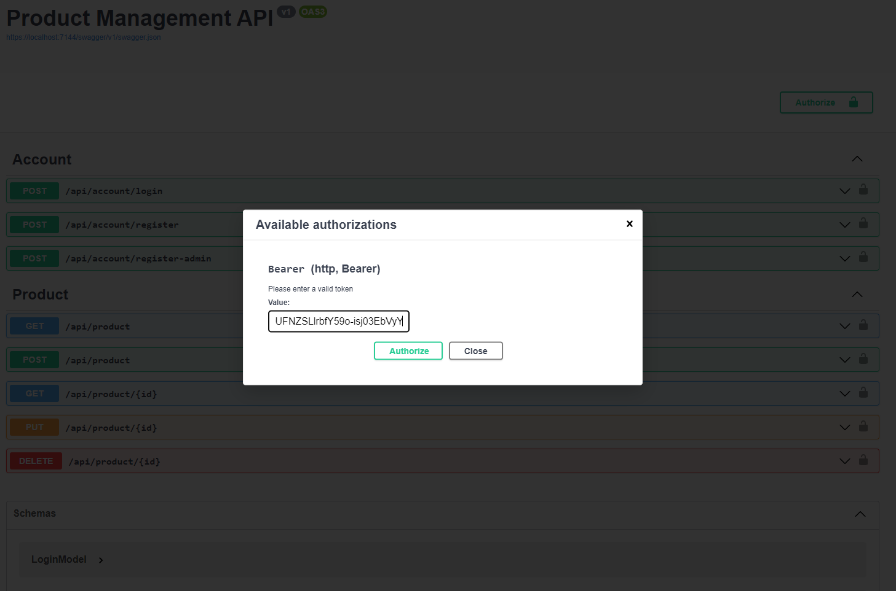

# Product-Management-API

Via the API you can manage products in the database assigned to it.\
The database migration included in the project, so it's very easy to generate new one and work with it.\

The project is made by **3-Layer Architecture principles**.

# Layers 
1. Data Layer
2. Business Layer
3. Presentation Layer

DbContext included in Class Library (Data Layer) which supports Design-Time generation and ConnectionString provided directly in the DbCotext via overriding OnConfiguring method and providing options to DbContextOptionsBuilder.

Included **Cuncurrency Check** for product availability check (**Available** property).

API supports **Authentication** and **CRUD** operations.

You can test API functionality by using built in Swagger in which included Authentication security or by other similar tool like **Postman**.\
After successful login you can keep the authentication by generated **JWT** token and test as well functions which require authentication with **[Authorize]** attribute.

Sample database included in the project as well in "db" folder

# Screenshots

